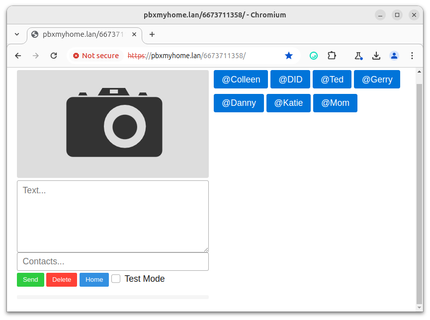
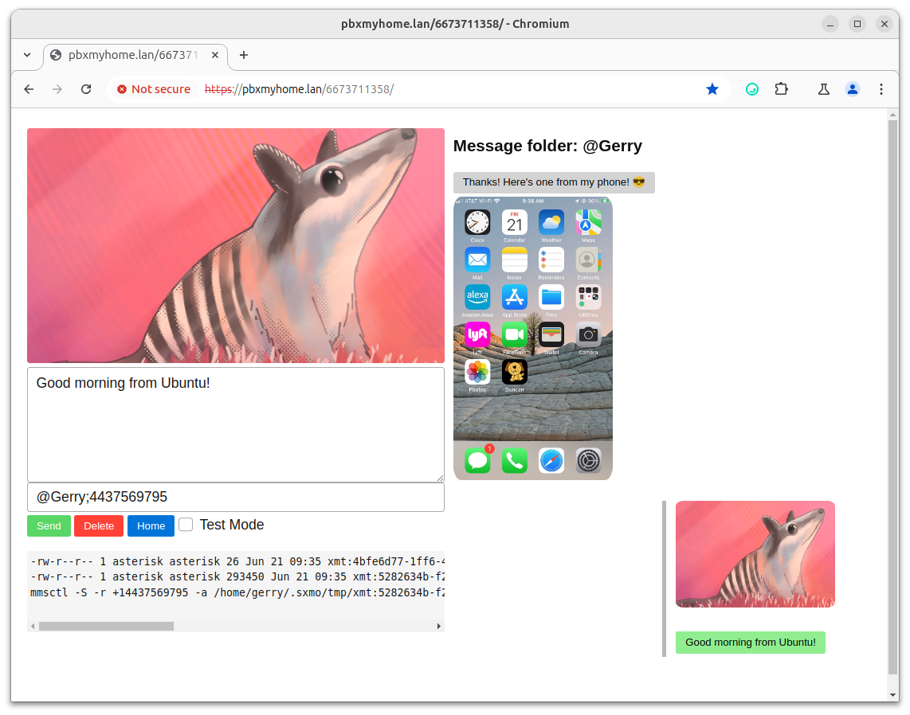

# MobileMessaging
A collection of utilities and a browser-based client for sending/receiving SMS/MMS messages on Linux using a USB cellular modem
<p></p>

# Background
At first I only set out to build a simple browser-based client to send/receive SMS and MMS messages using [Flowroute’s messaging API](https://developer.flowroute.com/api/messages/v2.2/).  Then I ran into the brick wall known as A2P (Application-to-Person) 10DLC registration.  Essentially in order to use the messaging APIs for any of the VoIP service providers, you must first register your “Brand” and “Campaign” with them, and they in turn register these with [“The Campaign Registry”](https://www.campaignregistry.com/).  If you’re a simple user like me who only wants to send P2P (Person-to-Person) messages, you’ll soon find yourself shut out of the messaging platforms altogether.  Flowroute would not even accept my 10DLC application, even though I obtained an EIN from the IRS precisely so I would qualify as a business.  Since the entire process is controlled by the Mobile Network Operators – and is not government regulated – it’s impossible to seek any remedy if you get denied.  And I thought less government regulation was supposed to be a good thing! 😊

# Architecture
So I set out to send/receive text messages through the cellular network directly.  I went searching for some free/open-source Linux software that could perform messaging through a USB cellular modem.  Most of the work in this area has been done to support development of the [PinePhone](https://pine64.org/devices/pinephone/), a mobile phone with Debian Linux at its core.  The key components are [ModemManager](https://modemmanager.org/) and [mmsd-tng](https://gitlab.com/kop316/mmsd).  There’s also an SMS/MMS messaging client available for the GNOME desktop called [Chatty](https://gitlab.gnome.org/World/Chatty), but I decided to hack together my own client since I wanted API access to the messaging interface that Chatty didn’t offer.  Thankfully I found [SXMO](https://sxmo.org/), which showed me how to interact with the modem stack using mmcli, mmsctl and D-Bus.  The version of SXMO posted here is a greatly stripped down version of what’s available on the official repo, and includes a simple Python HTTP server to support API calls and file retrieval.
<p></p>

# USB modem and cellular plan
My solution uses a [Quectel EC25-AF(D)](https://www.quectel.com/product/lte-ec25-series/) modem, since that’s the technology used in the PinePhone.  Before purchasing a modem (I got [this one]( https://www.aliexpress.us/item/3256803392917668.html?gatewayAdapt=glo2usa) from AliExpress for $50) I confirmed the device is supported by the U.S. mobile operators:

+ [AT&T approved devices](https://iotdevices.att.com/certified-devices.aspx)
+ [Verizon approved devices](https://opendevelopment.verizonwireless.com/design-and-build/approved-modules)
+ [T-Mobile approved devices](https://wholesale.t-mobile.com/iot/modules-chipsets-devices/)

As regards a mobile data plan, I went with Red Pocket since they [offer service on all three carriers](https://www.redpocket.com/coverage).  The APN settings needed to set up Modem Manager and mmsd-tng are [documented here](https://help.redpocket.com/setup-your-activated-gsma-sim-card) 

# Ubuntu installation
I’m running the latest LTS release of Ubuntu (24.04/noble), with the following additional packages:
```
apt install ksh jq pnc mmsd-tng
```
The standard Ubuntu/Debian release already includes ModemManager, so there’s no need to install the snap (in fact, it’s better to use the .deb package vs. the snap since you’ll run into some D-Bus permission issues if you install the snap).  I was fortunate to have chosen the most current Ubuntu distribution, since it contains recent releases of ModemManger (1.23.4-0ubuntu2) and mmsd-tng (2.6.0-2build1).  These packages are still under active development, and I rely on features that have been introduced in just the past few months.  

Instructions for configuring the modem can be found on Ubuntu’s [How-to page]( https://ubuntu.com/core/docs/networkmanager/configure-cellular-connections).  There's lots of other material out there on Debian's cellular modem stack, including [this blog post](https://junyelee.blogspot.com/2021/03/linux-mobile-interface-broadband-model.html) I encountered during my investigations.  The specific nmcli command I used to configure my modem is listed below, as are a couple mmcli and ifconfig commands you can run to verify everything was set up properly:
```
nmcli c add type gsm ifname '*' con-name RedPocket apn ERESELLER
mmcli  -m any
ifconfig -a
```
ModemManager will establish IPv4 and IPv6 connections on the carrier's APN.  The software sets the route metric on the wwan interface higher than your other interfaces so the modem doesn't function as your default route to the Internet.  This is preferred so you don't burn through all of the data in your mobile data plan.  **Be sure to check**, however, that IPv6 is enabled on your machine's primary interface (Ethernet or Wifi).  If not, the kernel will route traffic to any IPv6 sites through your mobile interface, regardless of the assigned route metric. When configuring mmsd-tng, follow the instructions posted under "General Configuration" and "Configuring the Modem Manager Plugin" on Chris Talbot's site.  You'll find the appropriate APN, MMSC, and proxy settings on [Red Pocket's SIM activation page](https://help.redpocket.com/setup-your-activated-gsma-sim-card).  Here's the ~/.mms/modemmanager/mms file I'm using:
```
[Modem Manager]
CarrierMMSC=http://mmsc.mobile.att.net/
MMS_APN=ERESELLER
CarrierMMSProxy=http://proxy.mobile.att.net/
DefaultModemNumber=NULL
AutoProcessOnConnection=true
AutoProcessSMSWAP=true
IMSI=xxxxxxxxxxxxxxx

[Settings]
UseDeliveryReports=false
TotalMaxAttachmentSize=1100000
MaxAttachments=25
AutoCreateSMIL=true
ForceCAres=true
```
The sxmo utilities as well as mmsd-tng run as an ordinary user (not root), so they make use of the D-Bus “session” bus.  ModemManager, on the other hand, runs as root and resides on the D-Bus “system” bus.  In order for sxmo to talk to ModemManager, I did as follows (I’m sure there are more proper ways for granting privilege, but this was an easy hack!).  Execute these commands as root:
```
chmod u+s /usr/bin/mmcli

cat - >/etc/dbus-1/system-local.conf  <<EOF
<!DOCTYPE busconfig PUBLIC
"-//freedesktop//DTD D-Bus Bus Configuration 1.0//EN"
"http://www.freedesktop.org/standards/dbus/1.0/busconfig.dtd">
<busconfig>
    <policy user="*">
        <allow eavesdrop="true" send_destination="*"/>
    </policy>
</busconfig>
EOF
```

# sxmo tools
As I mentioned above, these tools run as an ordinary user.  In my case, I have a user “gerry” which is configured to autologin at boot time.  The sxmo files are installed under ~/opt/sxmo.  Be sure to set execute permission on the files after copying them. 

There are two environment variables you need to configure within sxmo.sh for your particular installation:
+ **SXMO_MYHTTP** This is the base URL for the Python web server on your Ubuntu host, e.g. http://ubuntu.lan:8000.  The Python server implements an API modeled after Flowroute's implementation, as well as a file retrieval mechanism which the software on the Raspberry Pi uses to send/receive messages. The Python server uses ordinary HTTP not HTTPS, since all communication with the sxmo environment will take place inside your internal LAN.  Technically the software on the Raspberry Pi (Apache & accompanying CGI scripts) can be hosted on the Ubuntu server, but I decided to separate these since I already had a Pi running FreePBX & Asterisk to support voice calls over my VoIP line (take a look at: [PBX-My-Home](https://github.com/glmck13/PBX-My-Home)).  In addition, my Raspberry Pi is firewalled off and Internet-accessible, and I did not want to do the same for my Ubuntu host.

+ **SXMO_WEBHOOK** This is the URL of the CGI function on the Raspberry Pi which the sxmo software invokes whenever it receives an SMS/MMS from the modem stack, e.g. https://pbxmyhome.lan/$SXMO_MYNUM/rcvmms.cgi

The easiest way I found to launch the sxmo.sh script is to configure it as a Startup Application.  Just click on “Startup Applications” from your Ubuntu desktop, and add an entry for sxmo.sh.  

# Raspberry Pi installation
The messaging client consists of back-end CGI scripts hosted on an Apache server, and front-end html, css, and javascript running inside a browser.  The Apache server needs to have https configured since javascript 'fetch' calls are made by the browser code, and 'fetch' prefers https.  Fortunately, there's no need to acquire a public cert for your site to use the messaging software, assuming you only want to make use of the capability from inside your own network.  However, if you want to access your messaging client from outside of your LAN when you're on the go, you'll eventually need a cert.  In this case the cert won't be used for Apache, but to configure a home VPN.  Instructions for setting up a VPN can be found [here]( https://github.com/glmck13/MobilePi).  

Once your site is https-enabled, the rest of the installation is pretty simple. First, execute the following as root:
```
apt install ksh uuid-runtime gridsite-clients
a2enmod cgid
sed -i -e "s/^#\([[:space:]]*AddHandler[[:space:]]*cgi-script[[:space:]]*\.cgi\)$/\1/" /etc/apache2/mods-available/mime.conf
sed -i -e "s/^\([[:space:]]*Options Indexes FollowSymLinks\)$/\1 ExecCGI/" /etc/apache2/apache2.conf
```
Next, install the contents of the 'client' directory located in this repository directly under /var/www/html/**your_mobile_number** on the server then execute:
```
chmod +x *.cgi *sh *.py
mv htaccess .htaccess
```
Lastlty, edit the two getenv files and populate your local settings.  Variables other than those specified below only apply for a Flowroute backend, and are ignored otherwise.
+ **msgapp_server**  This should match what you specified for SXMO_WEBHOOK, stripping off the '/rcvmms.cgi' at the end.
+ **MSGAPP_BACKEND**  Leave this set to SXMO.
+ **MSGAPP_SENDAPI**  This should match what you specified for SXMO_MYHTTP, appending '/cgi-bin/sxmo_sendapi.py' at the end.
+ **MSGAPP_DID** This is your mobile number, including the "+1" country code prefix.

That's it!
