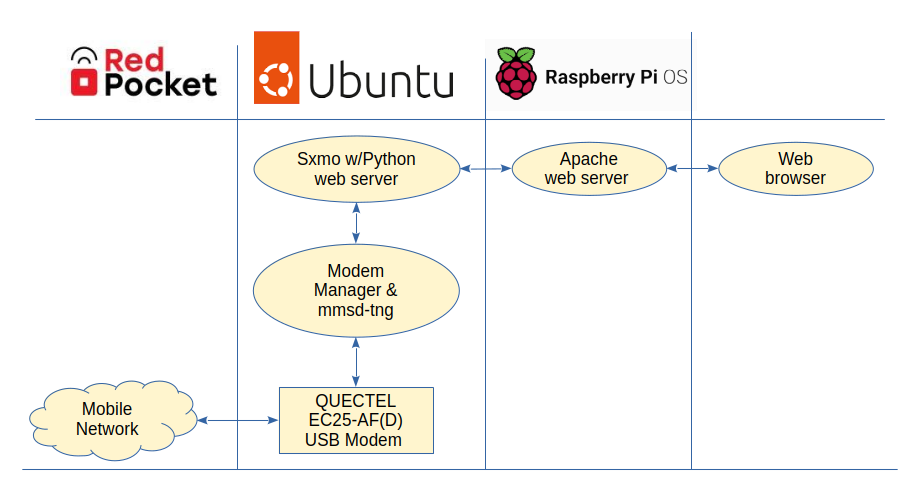

# MobileMessaging
A collection of utilities and a browser-based client for sending/receiving SMS/MMS messages on Linux using a USB cellular modem
<p></p>

# Background
At first I only set out to build a simple browser-based client to send/receive SMS and MMS messages using [Flowroute’s messaging API](https://developer.flowroute.com/api/messages/v2.2/).  Then I ran into the brick wall known as A2P (Application-to-Person) 10DLC registration.  Essentially in order to use the messaging APIs for any of the VoIP service providers, you must first register your “Brand” and “Campaign” with them, and they in turn register these with [“The Campaign Registry”](https://www.campaignregistry.com/).  If you’re a simple user like me who only wants to send P2P (Person-to-Person) messages, you’ll soon find yourself shut out of the messaging platforms altogether.  Flowroute would not even accept my 10DLC application, even though I obtained an EIN from the IRS precisely so I would qualify as a business.  Since the entire process is controlled by the Mobile Network Operators – and is not government regulated – it’s impossible to seek any remedy if you get denied.  And I thought less government regulation was supposed to be a good thing! 😊

# Architecture
So I set out to send/receive text messages through the cellular network directly.  I went searching for some free/open-source Linux software that could perform messaging through a USB cellular modem.  Most of the work in this area has been done to support development of the [PinePhone](https://pine64.org/devices/pinephone/), a mobile phone with Debian Linux at its core.  The key components are [ModemManager](https://modemmanager.org/) and [mmsd-tng](https://gitlab.com/kop316/mmsd).  There’s also an SMS/MMS messaging client available for the GNOME desktop called [Chatty](https://gitlab.gnome.org/World/Chatty), but I decided to hack together my own client since I wanted API access to the messaging interface that Chatty didn’t offer.  Thankfully I found [SXMO](https://sxmo.org/), which showed me how to interact with the modem stack using mmcli, mmsctl and D-Bus.  The version of SXMO posted here is a greatly stripped down version of what’s available on the official repo, and includes a simple Python HTTP server to support API calls and file retrieval.
<p></p>

# USB modem and cellular plan
My solution uses a [Quectel EC25-AF(D)](https://www.quectel.com/product/lte-ec25-series/) modem, since that’s the technology used in the PinePhone.  Before purchasing a modem (I got [this one]( https://www.aliexpress.us/item/3256803392917668.html?gatewayAdapt=glo2usa) from AliExpress for $50) I confirmed the device is supported by the U.S. mobile operators:

+ [AT&T approved devices](https://iotdevices.att.com/certified-devices.aspx)
+ [Verizon approved devices](https://opendevelopment.verizonwireless.com/design-and-build/approved-modules)
+ [T-Mobile approved devices](https://wholesale.t-mobile.com/iot/modules-chipsets-devices/)

As regards a mobile data plan, I went with Red Pocket since they [offer service on all three carriers](https://www.redpocket.com/coverage).  The APN settings needed to set up Modem Manager and mmsd-tng are [documented here](https://help.redpocket.com/setup-your-activated-gsma-sim-card) 

# Ubuntu installation
I’m running the latest LTS release of Ubuntu (24.04/noble), with the following additional packages:
```
apt install ksh pnc
```
Instructions for configuring the modem can be found on Ubuntu’s [How-to page]( https://ubuntu.com/core/docs/networkmanager/configure-cellular-connections).  Note that the standard Ubuntu/Debian release already includes ModemManager, so there’s no need to install the snap (in fact, it’s better to use the .deb package vs. the snap since you’ll run into some D-Bus permission issues if you install the snap).  As I recall mmsd-tng also comes included in the standard distribution, but if that’s not the case, you can simply apt install it as root (again, install the package, not the snap).  

ModemManager will by default assign a higher route metric on the wwan interface so this connection doesn't function as your default route to the Internet.  This is preferred so as not to burn through all of the data in your mobile data plan.  MobileManager will also enbale IPv6 on the wwan link.  **Be sure to check**, however, that IPv6 is enabled on your primary route.  If not, the kernel will route traffic to any IPv6 sites through your mobile interface, regardless of the metric value.  

When configuring mmsd-tng, follow the instructions posted under "General Configuration" and "Configuring the Modem Manager Plugin" on Chris Talbot's site.  You'll find the appropriate APN, MMSC, and proxy settings on [Red Pocket's SIM activation page](https://help.redpocket.com/setup-your-activated-gsma-sim-card).

The sxmo utilities as well as mmsd-tng run as an ordinary user (not root), so they make use of the D-Bus “session” bus.  ModemManager, on the other hand, runs as root and resides on the D-Bus “system” bus.  In order for sxmo to talk to ModemManager, I executed the following as root (I’m sure there are more proper ways for granting privilege, but this was an easy hack!):
```
chmod u+s /usr/bin/mmcli

cat - >/etc/dbus-1/system-local.conf  <<EOF
<!DOCTYPE busconfig PUBLIC
"-//freedesktop//DTD D-Bus Bus Configuration 1.0//EN"
"http://www.freedesktop.org/standards/dbus/1.0/busconfig.dtd">
<busconfig>
    <policy user="*">
        <allow eavesdrop="true" send_destination="*"/>
    </policy>
</busconfig>
EOF
```

# sxmo tools
As I mentioned above, these tools run as an ordinary user.  In my case, I have a user “gerry” which is configured to autologin at boot.  The sxmo files are installed under ~/opt/sxmo.  Be sure to set execute permission on the files after copying them. 

The easiest way I found to launch the sxmo.sh script is to configure it as a Startup Application.  Just click on “Startup Applications” from your Ubuntu desktop, and add an entry for sxmo.sh.
